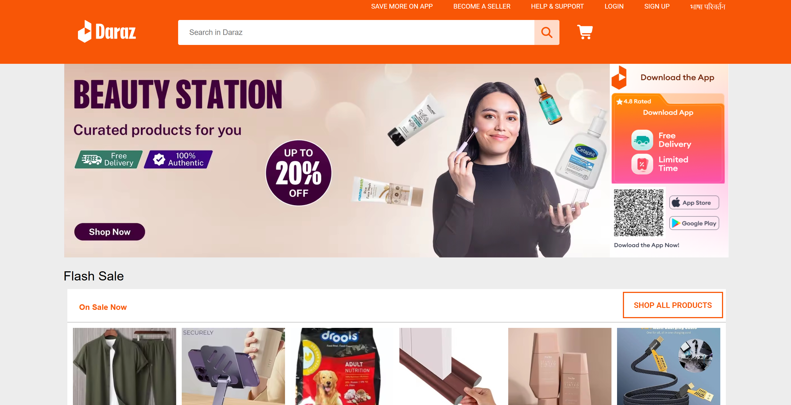
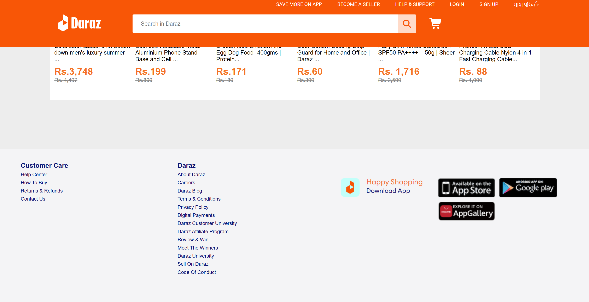

# 🛒 Daraz Clone (HTML & CSS)

A simple clone of the Daraz homepage built using only HTML and CSS.  
This project is created for learning and practice purposes only.

---

## 🚀 Features
- Responsive layout (basic)
- Clean UI design
- Navbar, banner, and product sections

---

## 🛠️ Built With
- HTML
- CSS

---

## 📸 Screenshot

## Real Daraz Website

## My Clone Website

---

## 📌 Note
This is a frontend-only project (no backend or functionality).

---

## 👤 Author
Sujan Adhikari  
GitHub: https://github.com/adhikari-sujan
